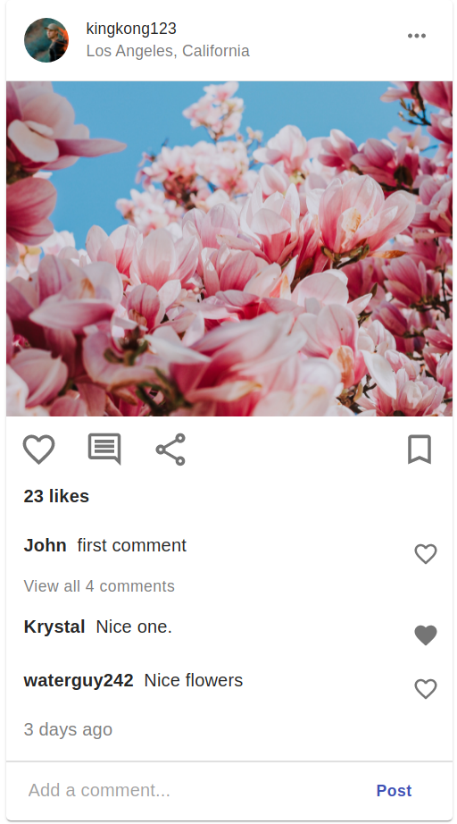
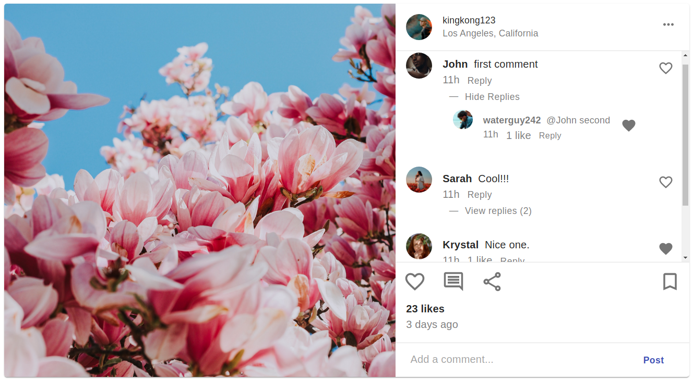

This project was bootstrapped with [Create React App](https://github.com/facebook/create-react-app), using the [Redux](https://redux.js.org/) and [Redux Toolkit](https://redux-toolkit.js.org/) template.

## Deployed using Github Pages at this [link](https://kennethnguyen.github.io/instagram-post-clone/)

## Description

Using React, Redux, and Material UI to create a clone of the two versions of Instagram posts (mobile portrait and web view landscape) with a few functionality features. Front-end application only with hardcoded mock data and data persistence to local storage. The user is able to tinker around with this application as 'waterguy242' :)

## Screenshots



## Features

- Add a comment
- Like a comment
- Reply to a comment
- Like a replied comment
** Every other feature is not functional and all other details (time elapsed, post likes, etc.) are hardcoded

## Post Data Design

```
   posts: [
    {
      id: int,
      creator: {
        username: string,
        location: string,
        profilePicture: string, // string path to static resource
      },
      media: string // file name to static image resource
      likes: int,
      createdAt: Date().toISOString()
      isLandscape: boolean, // denotes whether the post is portrait or landscape version
      replying: [boolean, int], // indicate whether the current comment is a reply to a comment or a comment to the post and the comment id of the comment to reply to
      comments: [
        {
          id: int,
          postedBy: string,
          profilePicture: string, // string path to static resource
          message: string,
          liked: boolean,
          replies: [{}], // an array of comment element objects; identical properties to this current comment object
          repliedTo: int || null, // id of comment that this comment replied to or null if not used to reply to any
        },
    },
  ]
```

## Running locally
- Clone this repository
- Run `npm install` to install all necessary dependencies
- Run `npm run start` and go to localhost:3001 in local browser to see app

## Notes / Takeaways

- It was my first time working with Redux, but I knew about Redux + Redux Toolkit and I was familiar with state management in React from using Context API + useReducer so getting Redux set up (especially with CRA redux toolkit boilerplate) went pretty quick but there were some issues with syntax and figuring out which part of the redux store state I was working with in the reducers and from useSelector().
- The biggest hurdle with this app (so far) would have to be designing the post and thinking about all the components and how everything can tie in together. It would have been simple to hardcode everything and simplify the global state to only have the comments since it was only one instagram post, but it was a more exciting challenge to think about the scale of the app and what it would be like if this was designed to handle multiple posts later in the future.
- Having React read in static local images and adjusting Material UI's CardMedia component styles to display a (static) image took much more googling than it should have.
- Since the interaction with this app is only with 1 user that's hardcoded into local storage, the 'liked' property for a comment will also be the number of likes a comment has (either 0 for false or 1 for true). In a real production app with a database, there would be a 'likes' property for the comment that checks for unique users that liked the comment.
- The static image dimensions (height, width) was a prop that can be adjusted to make the PostMedia component reusable for both versions
- Reusing the components from the portrait version to the landscape version was mostly seamless with some new adjustments for style
- The only truly dynamic component with specific UI changes was the comments section. Refactored the comment component to check whether the post version was landscape or portrait to display specific UI details.
- The components are not scaled with fluid percentages and values (for the most part) so they are not responsive
- The 'replying' property for a post is designed with the intention of a single user interacting with the application locally and no multiple-user concurrent interactions that would change the value of it.
- I got stuck on nesting replies for comments. I had the idea of re-using the comment component for nesting the replies for a comment, but showing the replies is part of the comment compoent. For now, there is no nesting of replies.
- So far all the testing done has been manual, but I'd eventually like to write unit tests with Jest/React-Testing-Library to learn how to test React components

## Future Implementation

- Currently 'isLandscape' attribute for a post isn't actually used since theres no way to switch between the two versions. The property is currently set to true for the landscape version component to showcase the landscape UI design. Ideally when clicking 'View all x comments' in the portrait version will toggle the 'isLandscape' property and switch the post to landscape version.
- Implement '...more' to shorten long comments
- Nest replies
- Have specific css style file for components
- Other features and functionalities for the Instagram post clone

## Edge Cases Unaccounted

- Replying to a reply
- No way to cancel the reply action to a comment; only switching which comment to reply to
- Should portrait comments have all the properties (avatar icon, reply option, likes, etc.) if there isn't a 'View all x comments' option? Or even, is there always supposed to be a 'View all x comments'?
- Unable to manually @username to reply to them; not sure how Instagram handles this or if it is a feature
- Able to remove the @username from a reply and the comment will still be a reply; also not sure how Instagram handles this

## Notable Errors

- HTML `<div>` and `<p>` elements nested inside `<p>` element for comment secondary text - [StackOverflow link](https://stackoverflow.com/questions/41928567/div-cannot-appear-as-a-descendant-of-p)

## Resources

- [Deploying React App to gh-pages](https://github.com/gitname/react-gh-pages)
- [Redux Toolkit + Redux docs](https://redux-toolkit.js.org/)
- [Persisting data to localstorage](https://dev.to/gautham495/how-to-persist-data-to-localstorage-in-react-with-hooks-6ma)
- [Material UI React framework](https://material-ui.com/)
- [Images](https://unsplash.com/)
- [Moment.js npm package to find the elpased time of the post's creation date](https://momentjs.com/)
